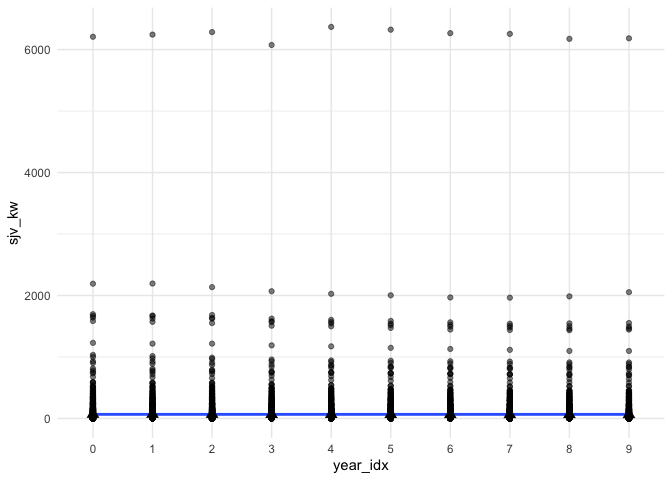
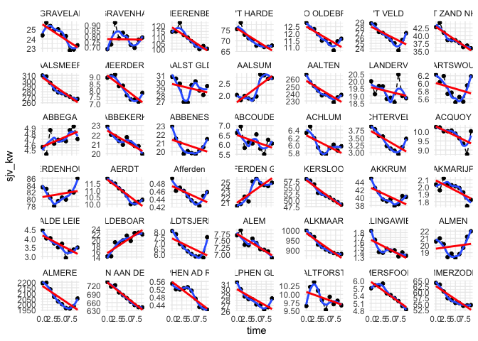
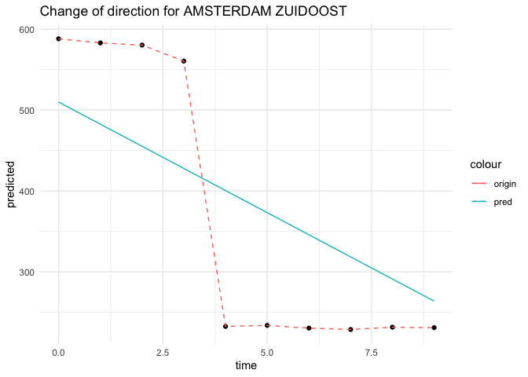

Geo Linear Multilevel Modeling
================
Koray Poyraz
2023-03-11

Within this notebook we will analyse the energy usage change direction
over time by applying Longitudinal data analysis utilizing Linear Mixed
Model on municipality level. The results can be utilized for depicting
the change of direction of each individual e.g. within Mapbox for
analysis.

Fixed effects represent the sjv mean that do not vary which we would
like to estimate. The random effects represent parameters that can vary
between municipalities of dependent data points. For example, if we
conduct several measurements on the same individual (municipality), the
mean of these measurements can represent one estimated parameter. So,
each individual (municipality) may then have an unique estimate. This
will allow us to estimate the slope of each individual that depicts the
energy demand. The data set starts at year 2012 until 2021. Therefore,
we will use year 2012 as base (starting point) at index 0. Finally, this
will result in overall intercept + slope along with individual
intercept + slope.

``` r
library(foreign) # install.packages("foreign") in case pkg does not exist
library(nlme) # install.packages("nlme") in case pkg does not exist
library(psych) # install.packages("psych") in case pkg does not exist
library(tidyverse) # install.packages("tidyverse") in case pkg does not exist
```

    ## ── Attaching core tidyverse packages ──────────────────────── tidyverse 2.0.0 ──
    ## ✔ dplyr     1.1.0     ✔ readr     2.1.4
    ## ✔ forcats   1.0.0     ✔ stringr   1.5.0
    ## ✔ ggplot2   3.4.1     ✔ tibble    3.1.8
    ## ✔ lubridate 1.9.2     ✔ tidyr     1.3.0
    ## ✔ purrr     1.0.1     
    ## ── Conflicts ────────────────────────────────────────── tidyverse_conflicts() ──
    ## ✖ ggplot2::%+%()    masks psych::%+%()
    ## ✖ ggplot2::alpha()  masks psych::alpha()
    ## ✖ dplyr::collapse() masks nlme::collapse()
    ## ✖ dplyr::filter()   masks stats::filter()
    ## ✖ dplyr::lag()      masks stats::lag()
    ## ℹ Use the ]8;;http://conflicted.r-lib.org/conflicted package]8;; to force all conflicts to become errors

``` r
library(mice) # install.packages("mice") in case pkg does not exist
```

    ## 
    ## Attaching package: 'mice'
    ## 
    ## The following object is masked from 'package:stats':
    ## 
    ##     filter
    ## 
    ## The following objects are masked from 'package:base':
    ## 
    ##     cbind, rbind

``` r
library(lmerTest)
```

    ## Loading required package: lme4
    ## Loading required package: Matrix
    ## 
    ## Attaching package: 'Matrix'
    ## 
    ## The following objects are masked from 'package:tidyr':
    ## 
    ##     expand, pack, unpack
    ## 
    ## 
    ## Attaching package: 'lme4'
    ## 
    ## The following object is masked from 'package:nlme':
    ## 
    ##     lmList
    ## 
    ## 
    ## Attaching package: 'lmerTest'
    ## 
    ## The following object is masked from 'package:lme4':
    ## 
    ##     lmer
    ## 
    ## The following object is masked from 'package:stats':
    ## 
    ##     step

# LME (Linear Mixed Effects) with linear time effect on municipality level

There are two versions of the data set: “wide format” and “long format”.
The former means that all observations are in separate rows (easier for
descriptive analysis) and the latter means that all observations from
different time points are on a separate line (so 9 lines per
municipality).

Wide format data structure

``` r
raw_data = read_csv('../../data/liander/jaarverbruik/all_years.csv')
```

    ## Rows: 1043 Columns: 11
    ## ── Column specification ────────────────────────────────────────────────────────
    ## Delimiter: ","
    ## chr  (1): WOONPLAATS
    ## dbl (10): sjv_2012, sjv_2013, sjv_2014, sjv_2015, sjv_2016, sjv_2017, sjv_20...
    ## 
    ## ℹ Use `spec()` to retrieve the full column specification for this data.
    ## ℹ Specify the column types or set `show_col_types = FALSE` to quiet this message.

``` r
raw_data = raw_data %>% rename(municipality=WOONPLAATS)
raw_data %>% head()
```

    ## # A tibble: 6 × 11
    ##   municipality   sjv_2…¹ sjv_2…² sjv_2…³ sjv_2…⁴ sjv_2…⁵ sjv_2…⁶ sjv_2…⁷ sjv_2…⁸
    ##   <chr>            <dbl>   <dbl>   <dbl>   <dbl>   <dbl>   <dbl>   <dbl>   <dbl>
    ## 1 'S-GRAVELAND    213783  225722  222511  218542  219554  215095  213012  199620
    ## 2 'S-GRAVENHAGE     5995    6373    8092    6848    7286    7000    6349    6106
    ## 3 'S-HEERENBERG  1006154 1008134 1074652  982631  963233  934762  902352  876284
    ## 4 'T HARDE        660848  686914  638137  624075  615995  594058  597165  588517
    ## 5 'T LOO OLDEBR…  112128  108898  108044  104784  100712  101427   98498   94435
    ## 6 'T VELD         252172  250260  237927  236238  230583  225046  219418  207640
    ## # … with 2 more variables: sjv_2020 <dbl>, sjv_2021 <dbl>, and abbreviated
    ## #   variable names ¹​sjv_2012, ²​sjv_2013, ³​sjv_2014, ⁴​sjv_2015, ⁵​sjv_2016,
    ## #   ⁶​sjv_2017, ⁷​sjv_2018, ⁸​sjv_2019

Descriptive Statistics, means, SD, median, min, max, 1st and 3th
quantile

``` r
summary(raw_data)
```

    ##  municipality          sjv_2012           sjv_2013           sjv_2014       
    ##  Length:1043        Min.   :    2694   Min.   :    2335   Min.   :    2583  
    ##  Class :character   1st Qu.:   49146   1st Qu.:   49340   1st Qu.:   49934  
    ##  Mode  :character   Median :  144143   Median :  141915   Median :  144228  
    ##                     Mean   :  615314   Mean   :  611046   Mean   :  603445  
    ##                     3rd Qu.:  426934   3rd Qu.:  424286   3rd Qu.:  419381  
    ##                     Max.   :54422131   Max.   :54733755   Max.   :55092954  
    ##     sjv_2015           sjv_2016           sjv_2017           sjv_2018       
    ##  Min.   :    2543   Min.   :    2562   Min.   :    2540   Min.   :    2546  
    ##  1st Qu.:   47348   1st Qu.:   48102   1st Qu.:   47636   1st Qu.:   47124  
    ##  Median :  138640   Median :  137644   Median :  136097   Median :  134441  
    ##  Mean   :  584198   Mean   :  584901   Mean   :  576907   Mean   :  569236  
    ##  3rd Qu.:  402344   3rd Qu.:  404020   3rd Qu.:  400632   3rd Qu.:  392598  
    ##  Max.   :53253124   Max.   :55832552   Max.   :55433090   Max.   :54935493  
    ##     sjv_2019           sjv_2020           sjv_2021       
    ##  Min.   :    2420   Min.   :    2322   Min.   :    2314  
    ##  1st Qu.:   46714   1st Qu.:   48755   1st Qu.:   49148  
    ##  Median :  134747   Median :  136264   Median :  133861  
    ##  Mean   :  564490   Mean   :  566328   Mean   :  567627  
    ##  3rd Qu.:  393345   3rd Qu.:  399998   3rd Qu.:  398433  
    ##  Max.   :54836591   Max.   :54131139   Max.   :54203980

Long format data structure. The mixed models need to be run on the data
in “long” format.

``` r
raw_pivot_data = read_csv('../../data/liander/jaarverbruik/all_years_pivot.csv')
```

    ## Rows: 10430 Columns: 4
    ## ── Column specification ────────────────────────────────────────────────────────
    ## Delimiter: ","
    ## chr (1): woonplaats
    ## dbl (3): year, sjv, year_idx
    ## 
    ## ℹ Use `spec()` to retrieve the full column specification for this data.
    ## ℹ Specify the column types or set `show_col_types = FALSE` to quiet this message.

``` r
raw_pivot_data = raw_pivot_data %>% rename(municipality=woonplaats)
raw_pivot_data %>% head()
```

    ## # A tibble: 6 × 4
    ##    year municipality         sjv year_idx
    ##   <dbl> <chr>              <dbl>    <dbl>
    ## 1  2012 'S-GRAVELAND      213783        0
    ## 2  2012 'S-GRAVENHAGE       5995        0
    ## 3  2012 'S-HEERENBERG    1006154        0
    ## 4  2012 'T HARDE          660848        0
    ## 5  2012 'T LOO OLDEBROEK  112128        0
    ## 6  2012 'T VELD           252172        0

Encode municipality and year applying factor function, making variables
categorical.

``` r
raw_pivot_data$id = as.numeric(as.factor(raw_pivot_data$municipality))
raw_pivot_data$municipality = factor(raw_pivot_data$municipality)
raw_pivot_data$time = raw_pivot_data$year_idx
raw_pivot_data$year_idx = factor(raw_pivot_data$year_idx)
```

``` r
to_kw <- function(kwh) {
  HOURS_IN_YEAR = 8766
  kw = kwh / HOURS_IN_YEAR
  return(kw)
}

to_mva <- function(kwh) {
  mva = to_kw(kwh) / 1000
  return(mva)
}


raw_pivot_data$sjv_kw = raw_pivot_data$sjv %>% map_vec(to_kw)
raw_pivot_data$sjv_mva = raw_pivot_data$sjv %>% map_vec(to_mva)
```

``` r
raw_pivot_data = raw_pivot_data %>% arrange(municipality) %>% select(id, municipality, sjv, year_idx, sjv_kw, sjv_mva, time)
raw_pivot_data %>% head()
```

    ## # A tibble: 6 × 7
    ##      id municipality    sjv year_idx sjv_kw sjv_mva  time
    ##   <dbl> <fct>         <dbl> <fct>     <dbl>   <dbl> <dbl>
    ## 1     1 'S-GRAVELAND 213783 0          24.4  0.0244     0
    ## 2     1 'S-GRAVELAND 225722 1          25.7  0.0257     1
    ## 3     1 'S-GRAVELAND 222511 2          25.4  0.0254     2
    ## 4     1 'S-GRAVELAND 218542 3          24.9  0.0249     3
    ## 5     1 'S-GRAVELAND 219554 4          25.0  0.0250     4
    ## 6     1 'S-GRAVELAND 215095 5          24.5  0.0245     5

``` r
p <- ggplot(data = raw_pivot_data, aes(x = year_idx, y = sjv_kw, group = id))
p + geom_point(alpha=.5) + geom_smooth(aes(group = 1)) + stat_summary(aes(group = 1), geom = "point", fun = mean, 
    shape = 17, size = 3) + theme_minimal()
```

    ## `geom_smooth()` using method = 'gam' and formula = 'y ~ s(x, bs = "cs")'

<!-- -->

Most of the municipalities have SJV kW lower than 2000 over the years,
except for one municipality which sits above 6000 (6 MVA).

Apply Polynomial Regression and Linear Regression on n municipalities,
the former depicts trend within a certain time frame whereas the latter
depicts the long-term trend (changing direction) over time

``` r
raw_pivot_data %>% filter(id %in% (1:42)) %>% 
  ggplot(aes(x=time, y=sjv_kw)) +
    geom_point() + 
    scale_y_continuous() +
    geom_line(linetype = "dashed") +
    geom_smooth(method=stats::loess, se=F) +
    geom_smooth(method = "lm", se = F, color='red', formula = 'y ~ x') +
    facet_wrap(~ municipality, scales = "free_y") +
    theme_minimal()
```

    ## `geom_smooth()` using formula = 'y ~ x'

<!-- -->

Correlations between SJV measurements

``` r
round(cor(raw_data[, 2:11], use="pairwise.complete.obs"), digits=3)
```

    ##          sjv_2012 sjv_2013 sjv_2014 sjv_2015 sjv_2016 sjv_2017 sjv_2018
    ## sjv_2012    1.000    1.000    1.000    1.000    0.992    0.992    0.992
    ## sjv_2013    1.000    1.000    1.000    1.000    0.993    0.993    0.992
    ## sjv_2014    1.000    1.000    1.000    1.000    0.993    0.993    0.993
    ## sjv_2015    1.000    1.000    1.000    1.000    0.993    0.993    0.993
    ## sjv_2016    0.992    0.993    0.993    0.993    1.000    1.000    1.000
    ## sjv_2017    0.992    0.993    0.993    0.993    1.000    1.000    1.000
    ## sjv_2018    0.992    0.992    0.993    0.993    1.000    1.000    1.000
    ## sjv_2019    0.992    0.992    0.993    0.993    1.000    1.000    1.000
    ## sjv_2020    0.992    0.992    0.993    0.993    1.000    1.000    1.000
    ## sjv_2021    0.992    0.992    0.993    0.993    1.000    1.000    1.000
    ##          sjv_2019 sjv_2020 sjv_2021
    ## sjv_2012    0.992    0.992    0.992
    ## sjv_2013    0.992    0.992    0.992
    ## sjv_2014    0.993    0.993    0.993
    ## sjv_2015    0.993    0.993    0.993
    ## sjv_2016    1.000    1.000    1.000
    ## sjv_2017    1.000    1.000    1.000
    ## sjv_2018    1.000    1.000    1.000
    ## sjv_2019    1.000    1.000    1.000
    ## sjv_2020    1.000    1.000    1.000
    ## sjv_2021    1.000    1.000    1.000

Apply model selection for the best fit. Simulate base model, m2, m3 for
anova comparison assuming linear time trend per municipality. We can
make the assumption that the (linear) time effect is different for each
individual by incorporating a random (linear) time effect, e.g. m2.

``` r
base_model = lme(fixed=sjv_kw ~ time, random=~1|municipality, data=raw_pivot_data, na.action="na.omit", method="ML")

m2 = update(base_model, random=~time|municipality)
m3 = update(m2, correlation = corExp(form = ~ time))
anova(base_model, m2, m3)
```

    ##            Model df      AIC      BIC    logLik   Test  L.Ratio p-value
    ## base_model     1  4 96078.00 96107.00 -48035.00                        
    ## m2             2  6 88065.72 88109.24 -44026.86 1 vs 2 8016.270  <.0001
    ## m3             3  7 85698.43 85749.19 -42842.21 2 vs 3 2369.298  <.0001

Summary of model 3

``` r
summary(m3)
```

    ## Linear mixed-effects model fit by maximum likelihood
    ##   Data: raw_pivot_data 
    ##        AIC      BIC    logLik
    ##   85698.43 85749.19 -42842.21
    ## 
    ## Random effects:
    ##  Formula: ~time | municipality
    ##  Structure: General positive-definite, Log-Cholesky parametrization
    ##             StdDev     Corr  
    ## (Intercept) 252.862454 (Intr)
    ## time          3.157646 -0.398
    ## Residual     15.351362       
    ## 
    ## Correlation Structure: Exponential spatial correlation
    ##  Formula: ~time | municipality 
    ##  Parameter estimate(s):
    ##    range 
    ## 3.872398 
    ## Fixed effects:  sjv_kw ~ time 
    ##                Value Std.Error   DF   t-value p-value
    ## (Intercept) 69.79310  7.843507 9386  8.898202       0
    ## time        -0.62306  0.120544 9386 -5.168737       0
    ##  Correlation: 
    ##      (Intr)
    ## time -0.346
    ## 
    ## Standardized Within-Group Residuals:
    ##          Min           Q1          Med           Q3          Max 
    ## -24.33806270  -0.04984944  -0.01383437   0.02191540  28.14946753 
    ## 
    ## Number of Observations: 10430
    ## Number of Groups: 1043

- Intercept (69.79310) is average kW score when time = 0.
- Estimate of random intercept s.d. 252.862454 indicates considerable
  fluctuation around fixed intercepts: municipalities can start quite
  higher/lower than average
- Per time unit (1 year) the kW score decreases on average by 0.62306
  for municipalities
- Estimate of random slope s.d. is 3.157646 -\> Meaning, for individuals
  (municipalities) the slope can be quite a bit steeper or flatter, may
  even be positive for some municipalities (as seen in the plot).

Note: random intercept and slope are negatively (-0.398) correlated (the
higher the intercept the more negative the slope); often true in
longitudinal data!

Show estimates of the first few random effects. This depicts the
estimated random effects for the intercept b0 and SJV slope b1 for the
first few municipalities. These first 6 intercepts and slopes are a mix
of positive and negative, meaning few municipalities have a higher/lower
than average intercept and higher/lower than average SJV slope.

``` r
head(ranef(m3))
```

    ##                  (Intercept)       time
    ## 'S-GRAVELAND      -44.428177  0.3654415
    ## 'S-GRAVENHAGE     -68.404831  0.5065879
    ## 'S-HEERENBERG      44.664442 -0.7742035
    ## 'T HARDE            4.859234 -0.1856890
    ## 'T LOO OLDEBROEK  -56.738668  0.3959660
    ## 'T VELD           -41.273916  0.3054823

Scatter plot of slope Time x Intercept

``` r
m3_coeff = coefficients(m3)
result = tibble(intercept=m3_coeff[[1]], time=m3_coeff[[2]])
result$municipality = rownames(m3_coeff)

result[,1:2] %>% 
  ggplot(aes(intercept, time)) + 
  geom_point(alpha=.3, color='blue') + 
  ggtitle('Time (slope) over Intercept') +
  theme_minimal()
```

<!-- -->

The plot depicts the level of kW usage change direction. E.g. the data
point at the left-bottom (\~ x=500 and y=-25) depicts a municipality
that has a steep slope compared to the majority. The majority holds
between 0 and -10 slope.

Find municipality with a steep slope

``` r
result %>% filter(time < -25)
```

    ## # A tibble: 1 × 3
    ##   intercept  time municipality      
    ##       <dbl> <dbl> <chr>             
    ## 1      510. -27.3 AMSTERDAM ZUIDOOST

Calculate the slope for AMSTERDAM ZUIDOOST

``` r
overall_slope = mean(coefficients(m3)[[2]])
zuidoost = result %>% filter(municipality == 'AMSTERDAM ZUIDOOST')
str_c('AMSTERDAM ZUIDOOST has a decrease of ', round(overall_slope + zuidoost$time, 2), ' kW per unit (year)')
```

    ## [1] "AMSTERDAM ZUIDOOST has a decrease of -27.96 kW per unit (year)"

``` r
ams_zuidoost = raw_pivot_data %>% filter(municipality == 'AMSTERDAM ZUIDOOST')
p1 = predict(m3, ams_zuidoost, se = TRUE)

ams_zuidoost %>% ggplot(aes(x=time)) +
  geom_point(aes(y=sjv_kw)) +
  geom_line(aes(y=sjv_kw, color='origin'), linetype = "dashed") +
  geom_line(aes(y=p1, color='pred')) +
  ylab('predicted') +
  ggtitle('Change of direction for AMSTERDAM ZUIDOOST') +
  theme_minimal()
```

<!-- -->

# Future work

LME on municipality + zipcode level for obtaining lower level insights.
E.g. depicting areas within municipalities that cause energy demand
